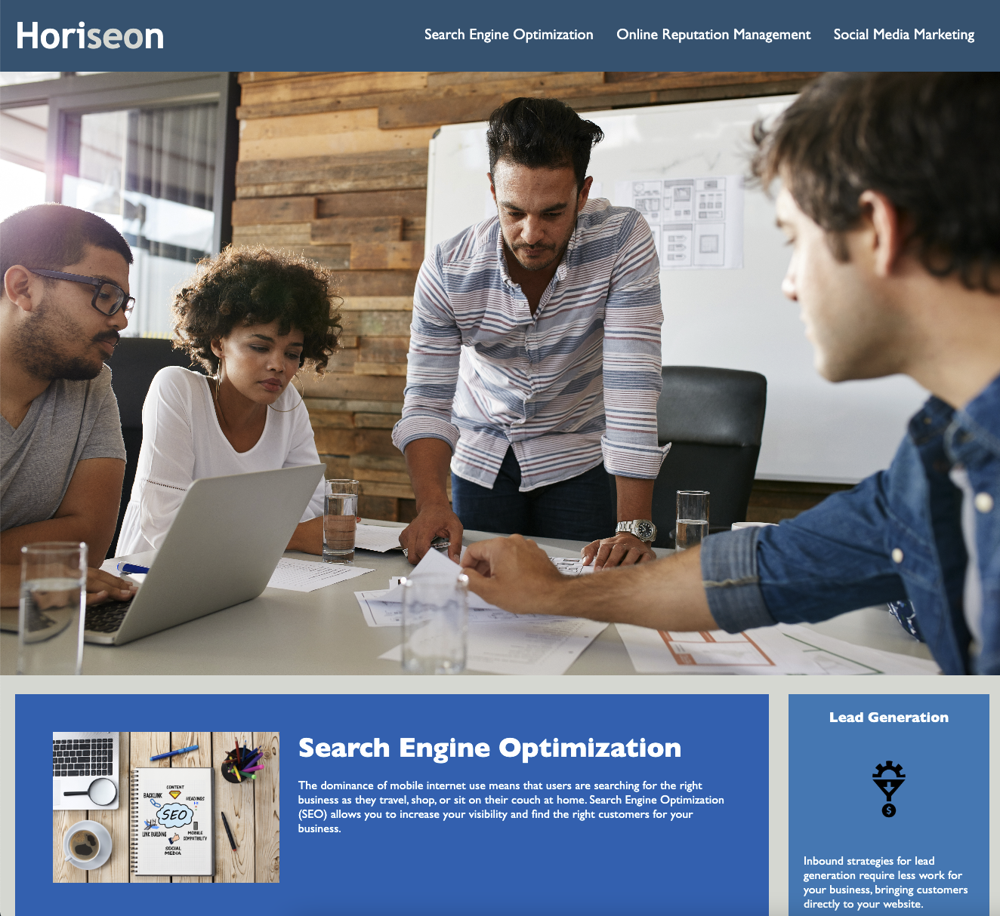
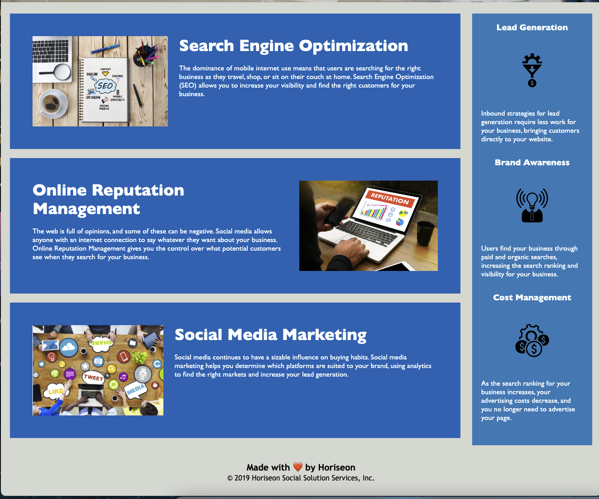

# first-week-challenge
USYD bootcamp challenge

The purpose of this task was to update a website to have a codbase that follows accessibility standards, so that the site is optimised for search engines.

Things that were resolved:
- asset tags were added to images
- CSS style sheet was trimmed down and organied in a better flow
- HTML was re-formatted to read more intuitively and semantically

Deployment link:
https://slingshort.github.io/first-week-challenge/

Images attached:

